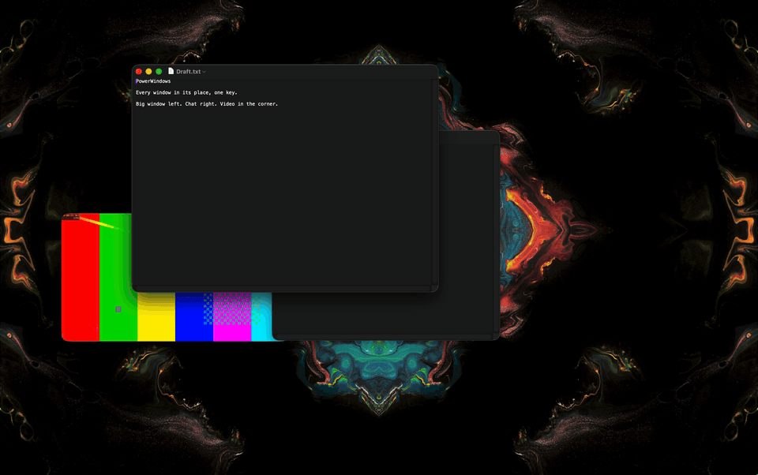

# PowerWindows.spoon
Forget that windows can be dragged.
Every window already knows its place. Need it elsewhere: one key. Press again: the second option.



| Key | Once | Again |
|---|---|---|
| `⌃⌥←` | left column | left half |
| `⌃⌥→` | right column | right half |
| `⌃⌥↑` | whole screen | native fullscreen |
| `⌃⌥↓` | every window back to its place | |

Also on: `⌃⌥WASD` = the arrows, `⇧` for halves and 60/40.

## Install

Unzip `PowerWindows.spoon.zip` from the latest release into `~/.hammerspoon/Spoons/`, then:

```lua
hs.loadSpoon("PowerWindows")
spoon.PowerWindows:start()
```

How to live with it: [docs/guide.md](docs/guide.md).

That's all. Everything below is optional.

## Optional

### Proportions

Defaults, every setting: [`config/settings.lua`](config/settings.lua). Layout settings explained: [docs/layout.md](docs/layout.md).
`gap` 1 and up = points.

```lua
spoon.PowerWindows:configure{ split = 0.68, gap = 8 }:start()
```

### Per-app places

Slots: `main`, `side`, `corner`, `stack`, `dialog`; `false` = never placed automatically. More: [docs/apps.md](docs/apps.md).

```lua
spoon.PowerWindows:configure{
  overrides = { ["com.tinyspeck.slackmacgap"] = "main", ["com.example.overlay"] = false },
}:start()
```

### Keys

All actions and rebinding: [docs/keys.md](docs/keys.md).
`🌐⌃` keys stay macOS's: [docs/macos-keys.md](docs/macos-keys.md).

```lua
spoon.PowerWindows:configure{ wasd = false }:start()
spoon.PowerWindows:bindHotkeys{ center = { { "ctrl", "alt" }, "c" } }
```

### Second screen

The window keeps its slot on the next screen. Each screen can have its own proportions: [docs/layout.md](docs/layout.md#screens).

```lua
spoon.PowerWindows:configure{ screens = { portrait = { split = 0.5 } } }:start()
hs.hotkey.bind({ "ctrl", "alt", "cmd" }, "right", function() spoon.PowerWindows:moveToScreen("next") end)
```

### Focus sets

One call: kept apps take their places, the rest hide. [docs/guide.md](docs/guide.md#focus-sets).

```lua
spoon.PowerWindows:configure{ focusSets = { work = { keep = { "com.jetbrains.rider" } } } }:start()
hs.hotkey.bind({ "shift", "ctrl", "alt", "cmd" }, "up", function() spoon.PowerWindows:focusSet("work") end)
```

### Missing app or dialog

One line in `config/catalog.lua` or `config/dialogs.lua`, as a pull request. For yourself: `overrides` ([docs/apps.md](docs/apps.md)).

### Inside

No folder holds more than seven entries.

```
init.lua       public API
config/        settings, catalog, dialogs
lib/core/      geometry, rules, settings (no Hammerspoon)
lib/window/    place, stack, actions, minimize, query, timers
lib/features/  hotkeys, globe, focus, screens, launch
docs/          guide, keys, apps, layout, macos-keys, changelog
```
